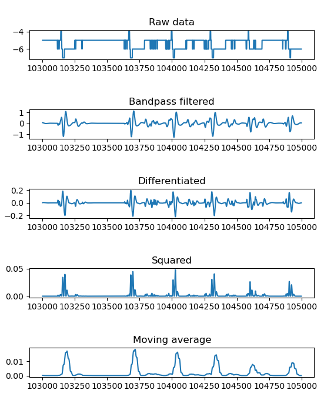
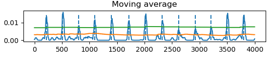
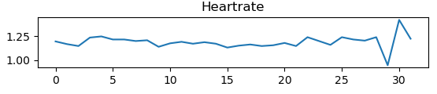

# ECG Heart-rate Detector

This project is a low deployment C++ application for ECG QRS Complex Detection. It utilizes the Pan-Tompkins Algorithm.

<https://courses.csail.mit.edu/18.337/2017/projects/subramanian_sandya/Papers/Pan%2BTompkins.pdf?>

Data:
<https://physionet.org/content/nstdb/1.0.0/old/>

The algorithm attenuates noise using an initial bandpass filter, with poles and zeros adjusted for the 1985 paper. Information about the slope of the QRS is obtained through a differentiation filter, and a squaring process is used to intensify the frequency response of the differentiation step. This helps with filtering for candidate peaks that are in reality T-waves. An averaging filter is used to produce a signal containing the slope and width of the QRS complex.

The filtered and integrated signal is then inserted through various tests. A pretraining phase is used to initialize thresholds, which lasts for 2s corresponding to 2*Fs samples. A window length of 150ms is used to condense QRS complex information during the averaging step. Samples are processed concurrently until a candidate peak is detected, whereafter thresholding is used to determine if a peak is a valid QRS complex or noise. If a peak is detected within 200ms, it is dropped as noise. Otherwise, thresholding is used. If it is detected within 200-360ms, it can either be a T-wave or an R-peak, whereafter a slope test is made. If all tests are passed, the wave is identified as a QRS complex.

All time dependencies are based physiological limitations, for example a heartbeat cannot physiologically occur within 200ms of each other due to refractory periods.

The model outputs streaming binary series of detected peaks.





---

## Requirements and setup

Preferably work in a conda environment

```
conda create -n project-env python=3.14.4
conda activate project-env

conda install -c conda-forge wfdb
```

---

## Development build

Requirements and install:
```
sudo apt install \
cmake libtool libtool-bin flex \
texinfo help2man bison
```

### Get data

From `/tools` folder, run:
```
./get_data.sh
```

### Natively compile code
From `/code/native`:
```
mkdir build
cd build
cmake ..
make
```

And execute using `./app`

To visualize results, run any python inspect file within `/tools/python/` folder.

---

## Bugs

* [ERROR] configure: error: no usable python found at /home/USER/anaconda3/bin/pythonX.XX
When building the toolchain, if you compiled the tool in a python env, you need to be inside that env to build the toolchain.

---

## Algorithm setup

* Bandpass filter
* Derivation operator
* Squaring operator
* Moving window integration
* Decision window

---

## Development Notes

* Toolchain config: aarch64-unknown-linux-gnu
* Bootloader config: qemu_arm64_defconfig

* The search for filtered peak for a candidate peak will use an estimated delay due to the pipeline. The estimated delay will be made in Python by averaging delay differences in filtered signal vs integrated signal.
* The estimated delay is around 26 samples.

* Window array size equation:
N=W*Fs
Where W is the time window to analyze.

* Using patient data `118e00.dat`
* Sampling Frequency: 360 Hz
* 650,000 samples
* 2 channel lead

### Development stages

* Make sure ECG file stream can run through QEMU to the application
* Use a TCP stream to simulate a host process
* Create a virtual serial sensor
* Eventually replace the sensor with real hardware interfaces
